# Splunk plug-in for Eclipse

#### Version 0.1

The Splunk plug-in for Eclipse provides tooling to support creating projects 
with the Splunk SDK for Java and running Java applications with instrumentation
on the JVM that logs the application's activity to Splunk.

Splunk is a search engine and analytic environment that uses a distributed
map-reduce architecture to efficiently index, search and process large 
time-varying data sets.

The Splunk product is popular with system administrators for aggregation and
monitoring of IT machine data, security, compliance and a wide variety of other
scenarios that share a requirement to efficiently index, search, analyze and
generate real-time notifications from large volumes of time series data.

The Splunk developer platform enables developers to take advantage of the same
technology used by the Splunk product to build exciting new applications that
are enabled by Splunk's unique capabilities.

## Getting started with the Splunk plug-in for Eclipse

The Splunk plug-in for Eclipse provides extensions to the Eclipse environment
to simplify creating projects using the Splunk SDK for Java. It provides a
new "Splunk SDK for Java" project kind, a set of code templates for common
tasks using the Splunk SDK for Java, and a launcher for Java applications that
logs JVM activity to a Splunk instance.

The information in this Readme provides steps to get going quickly, but for more
in-depth information be sure to visit the 
[Splunk Developer Portal](http://dev.splunk.com/). 

### Requirements

Here's what you need to get going with the Splunk plug-in for Eclipse.

#### Eclipse

The Splunk plug-in requires Eclipse 3.6.2 or later.

#### Splunk

If you haven't already installed Splunk, download it 
[here](http://www.splunk.com/download). For more about installing and running 
Splunk and system requirements, see 
[Installing & Running Splunk](http://dev.splunk.com/view/SP-CAAADRV). 

#### Splunk plug-in for Eclipse

You can install the Splunk plug-in for Eclipse by directly adding Splunk's p2
update site to your Eclipse instance.

In Eclipse, go to Help->Install new software.

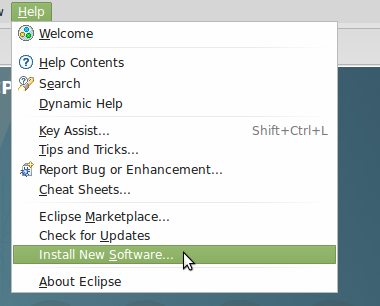

At the top of the dialog that opens, next to the combo box labeled "Work with:",
is a button labeled "Add". 

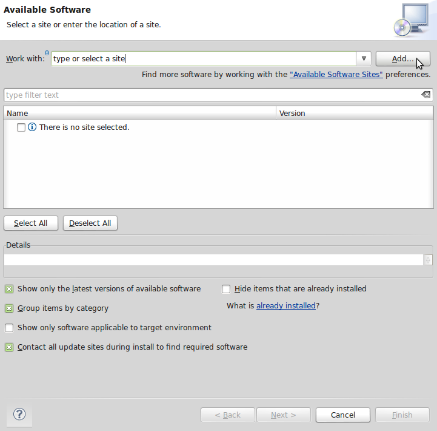

Click that, and it brings up a dialog to enter the information for a new Eclipse
update site. Name the site "Splunk", and put in 
http://dev.splunk.com/[TODO: FIXME] in the Location box. Then hit okay.

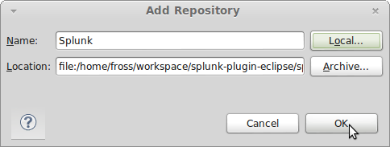

If Eclipse doesn't automatically select the new Splunk site in the "Work with"
box, click the combo box and select it. A single category, "Splunk", should
appear in the main pane of the dialog. Check the box next to it, and hit Next.

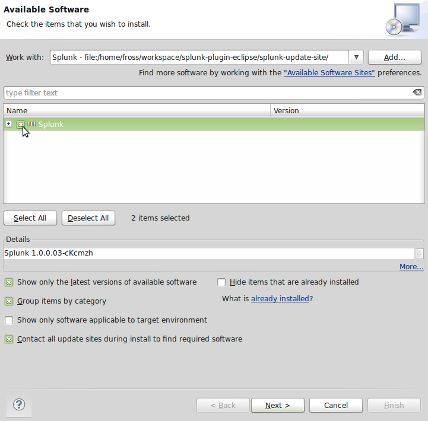

Eclipse will calculate requirements and dependencies, then show you a list of
the features to be installed. Hit Next again. 

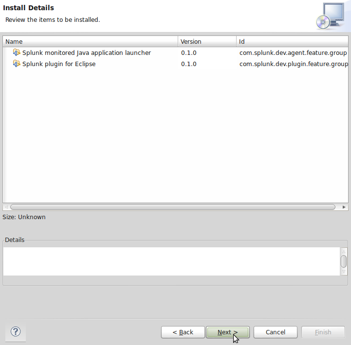

Accept the terms of the licensing agreements, and hit Finish.

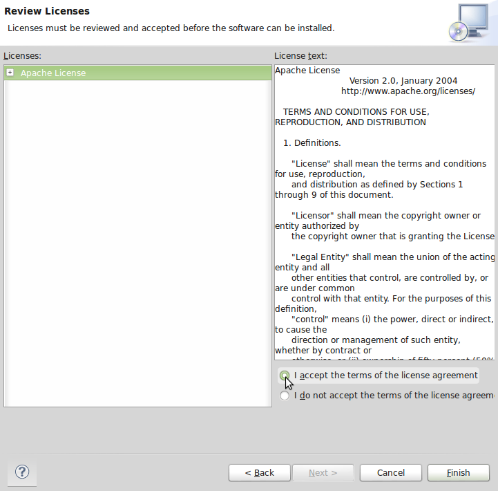

Eclipse will ask to restart. Tell it yes. When it restarts, the new plug-ins
should be installed.

### Creating a new Splunk SDK for Java project

The Splunk SDK for Java project wizard creates a project with the Splunk SDK
for Java jar included in the project and added to its classpath, and optionally
support for parsing CSV and JSON and logging (with Logback, Log4j, or 
java.util.logging) to Splunk.

To create a new Splunk SDK for Java project, go to the File->New->Project...
menu entry

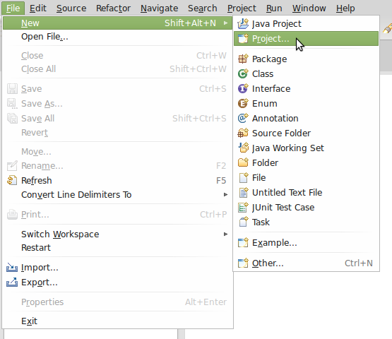

In the new project wizard, expand the Java category and select "Splunk SDK for
Java project". Click Next. 

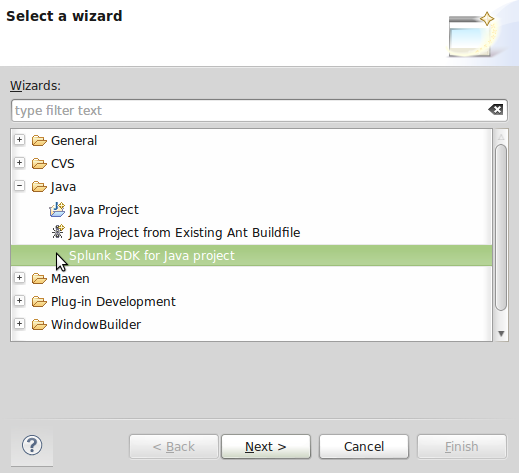

In the Splunk SDK for Java project wizard, enter a name for your project, set 
any Java project preferences you care for. The Splunk SDK for Java supports
Java 1.6 and higher, so any JDK satisfying that requirement will work. Then
choose which of the optional additional Splunk functionality you want.

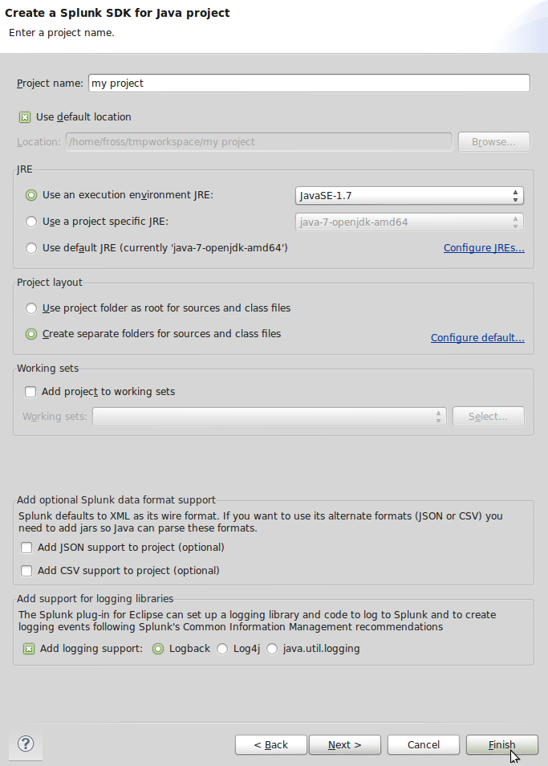

If you do not know whether you need Splunk support for JSON or CSV, then you 
almost certainly don't (since Splunk's default and preferred wire format is 
XML). If you are not planning to use a Java logging framework, you don't need
logging support. If you are planning on using one, selecting the logging
framework you want will add the jars for the framework, the jars for SL4J for 
that framework, and a logging configuration file set to write its logs to a
Splunk TCP input.

When you have finished setting up your fields click Finish. Eclipse will create
your new project with all the necessary libraries added to it.

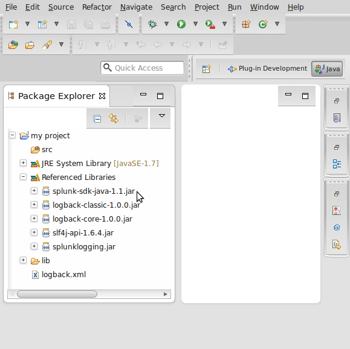

### Your first program using the Splunk SDK for Java

The most common idioms for using the Splunk SDK for Java are included in this
plug-in as templates. To write our first program, we will use two of these
templates to connect to a Splunk instance, run a search, and print the results.

In a new Splunk SDK for Java project created as described above, right click on
the `src` folder and select New->Class.

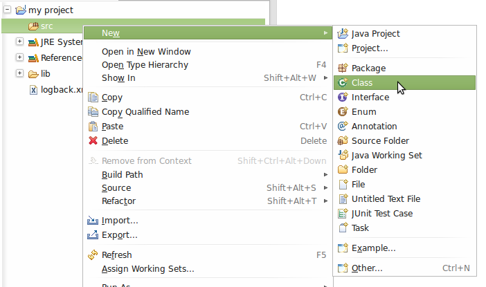

In the new class wizard, give your class a name (in this case `MyProgram`) and
add a `main` method. Click Finish.

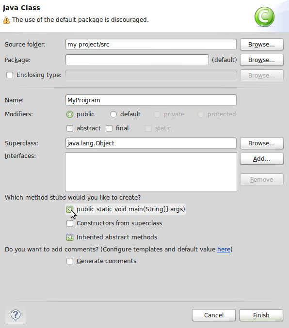

In the editor for the new class, put your cursor in the `main` method and type
`spl`. Then hit Ctrl+Space (or whatever you have autocomplete bound to in your
Eclipse environment) to pop up a list of all the Splunk templates (which all
begin with `spl`). 

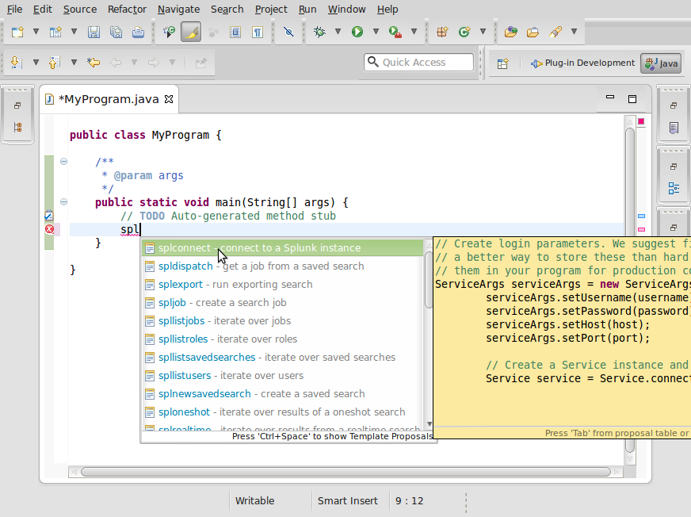

Select `splconnect`, and tab through the fields, filling in the values to
connect to the Splunk instance you will be testing against. The default values
for a local Splunk instance would be username `"admin"`, password `"changeme"`,
host `"localhost"`, and port 8089.

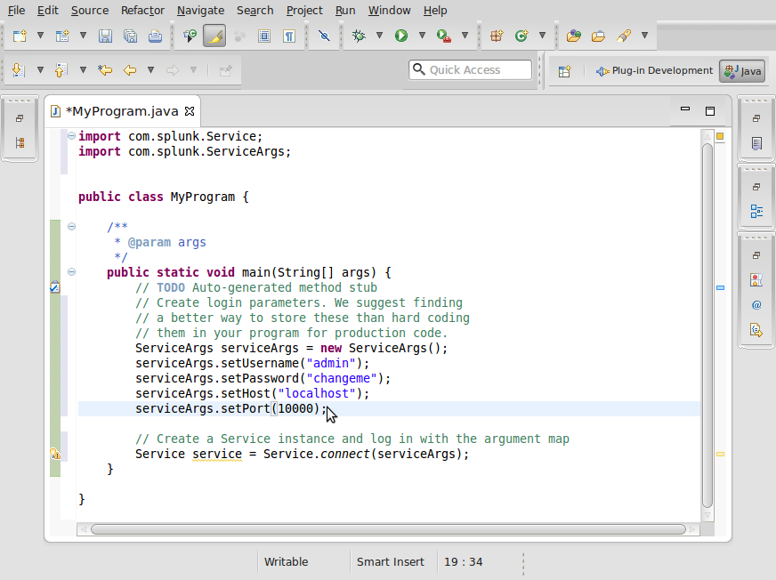

Then go to the bottom of the method, and type `sploneshot` and hit Ctrl+Space.

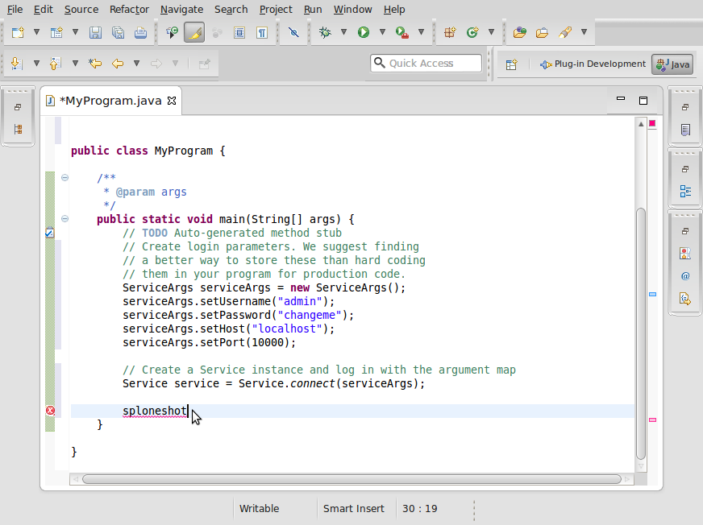

It will expand into the code necessary to run a oneshot search and print the
fields of each event returned by that search. 

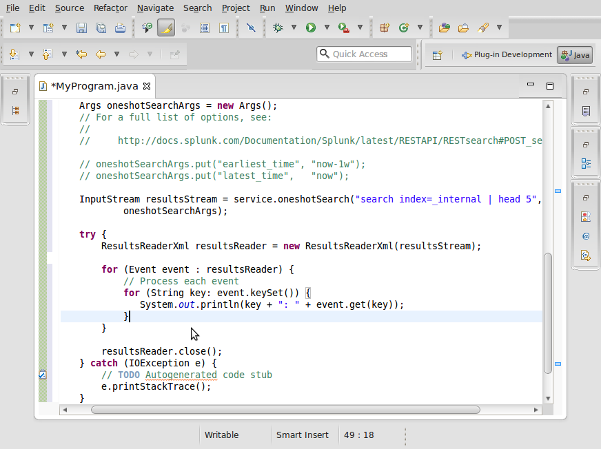

Set the search query to `"search index=_internal | head 5"`, and uncomment the
`for` loop that iterates over the event fields, as shown. Save the file and run
the program by clicking on the green arrow at the top of your Eclipse window.

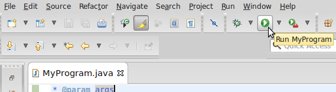

The program should run and in its console show a large number of key/value pairs
from the search, which you can check against running the same search in Splunk's
own UI.

### Using Splunk's semantic logging support

Splunk recommends using the [Common Information Model](http://docs.splunk.com/Documentation/Splunk/latest/Knowledge/UnderstandandusetheCommonInformationModel) for semantic logging. If you added logging support to your
Splunk SDK for Java project, the Splunk plug-in for Eclipse provides a libraries
and a set of templates to quickly create Common Information Model compliant log
entries. The templates all begin with `spog`: `spogdebug`, `spogerror`, `spoginfo`,
`spogtrace`, and `spogwarn`.

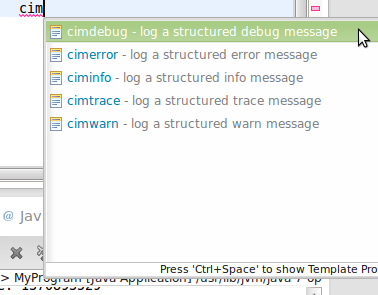

These templates expand into a single command that creates a new 
`SplunkLogEvent` and logs with via SL4J.

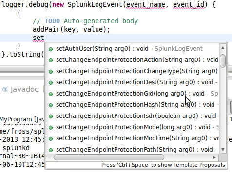

`SplunkLogEvent` objects provide a large number of setters for common fields
found in IT systems, or you can add any combination of key/value pairs with
calls to `addPair`.

The logging template assume that there is a variable `logger` in scope of class
`org.sl4j.Logger`. You can get one with the command

    Logger logger = LoggerFactory.getLogger("nameOfLogger");

and importing `org.sl4j.Logger` and `org.sl4j.LoggerFactory`. To actually make
it log to Splunk, you need to do a little bit of configuration. The Splunk SDK
for Java project wizard adds a default configuration file to your project. We
will assume that you chose to use Logback support, for which the configuration
file is called `logback.xml` in the root directory of your project. The 
configuration file will be named differently for other logging frameworks.

In `logback.xml`, you will find an element `appender` with `name="splunkrawtcp"`.
This defines a log appender which writes to a Splunk TCP input. By default it
writes to TCP port 5150 on `localhost`. You will need to add this input to your
Splunk instance (or change the host and port elements to point to a TCP input).
See Splunk's [documentation](http://docs.splunk.com/Documentation/Splunk/5.0.3/Data/Monitornetworkports#Add_a_network_input_using_Splunk_Web)
for instructions on how to set up a TCP input.

Then in the `logger` element at the bottom of the file, change `splunk.logger`
in the name attribute to whatever you chose as `nameOfLogger` when you created
your `Logger` object above.

### Running a Java application with the JVM activity logged to Splunk

The Splunk plug-in for Eclipse allows you to log the JVM activity of any Java
program, not just those using the Splunk SDK for Java, to a Splunk instance.

Create a run configuration for your program by going to the 
Run->Run configurations... menu.

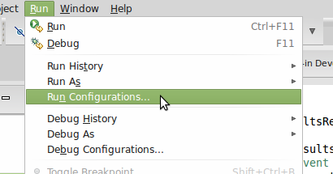

In the Run Configurations dialog, double click on "Monitored Java Application"
to create a new run configuration. 

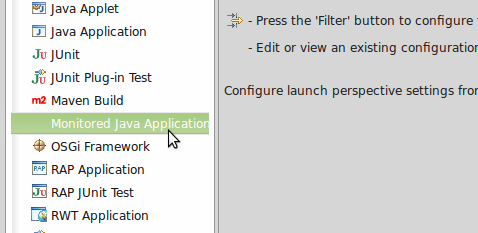

Set up the run configuration as if it were the Java Application launcher, and
then enter the host and port of a Splunk TCP input in the Splunk tab.

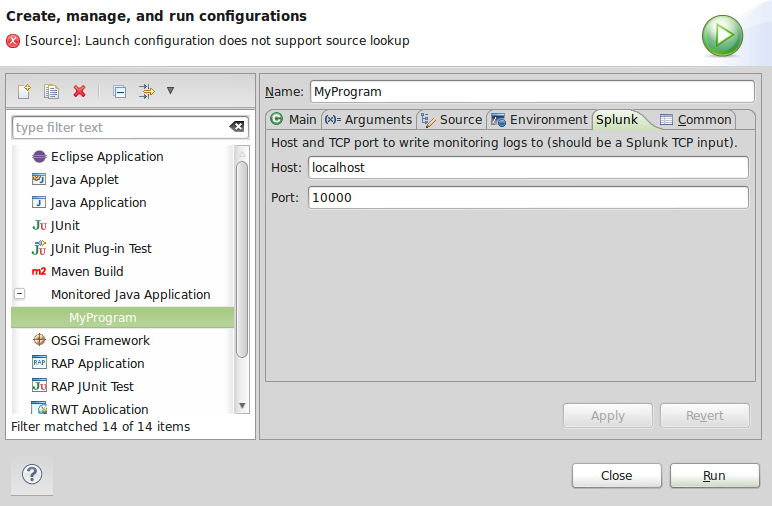

You will need to create the corresponding TCP input in your Splunk instance. See Splunk's [documentation](http://docs.splunk.com/Documentation/Splunk/5.0.3/Data/Monitornetworkports#Add_a_network_input_using_Splunk_Web)
for instructions on how to set up a TCP input.

Hit run and your program will start, while writing to Splunk. Note that testing
this on a trivial program with no method entrances or exits and which runs only
very briefly will likely log no data. The best program to test it on is one
which calls a number of methods repeatedly forever, which should produce a
steady stream of events in Splunk.

### How to run the test suite

The Splunk plug-in for Eclipse comes with a set of UI tests built in Xored's Q7. To run the tests, sign up for a Q7 account and download the Q7 IDE from [Xored](http://q7.xored.com/). Install the Splunk plug-in for Eclipse in a clean Eclipse IDE for Java. Fetch the Splunk Plug-in for Eclipse repository from GitHub.

In Q7, add the `com.splunk.project.java.test` project to your workspace by going to File->Import... 

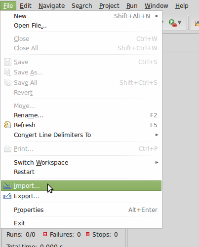

and selecting "Existing Projects into Workspace" in the General category. Click Next.

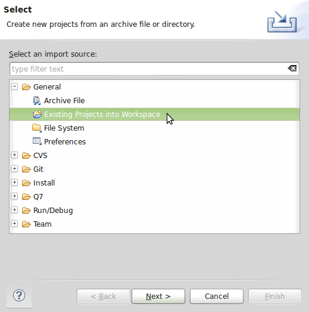

Click the Browse button to the right of the "Select root directory" text box, and navigate to the `com.splunk.project.java.test` directory in the Splunk Plug-in for Eclipse git repository. Click okay, and make sure the project test project is selected. Click Finish.

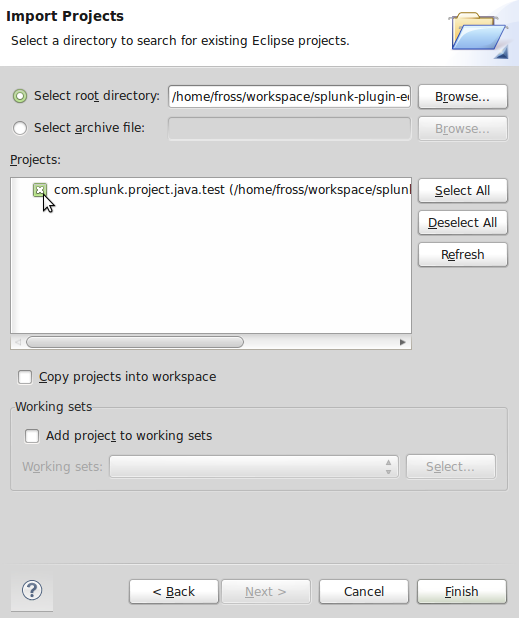

In the test, project right click on the 'Tests' entry and select Run As...->Test cases.

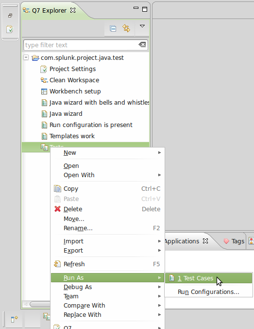

Q7 will show a dialog to add an application to test. Click Add... and select the directory of the Eclipse instance you installed the Splunk Plug-in for Eclipse in. Q7 will fill in the rest of the dialog automatically. Hit Finish.

Select the newly created application in the dialog, and hit OK.

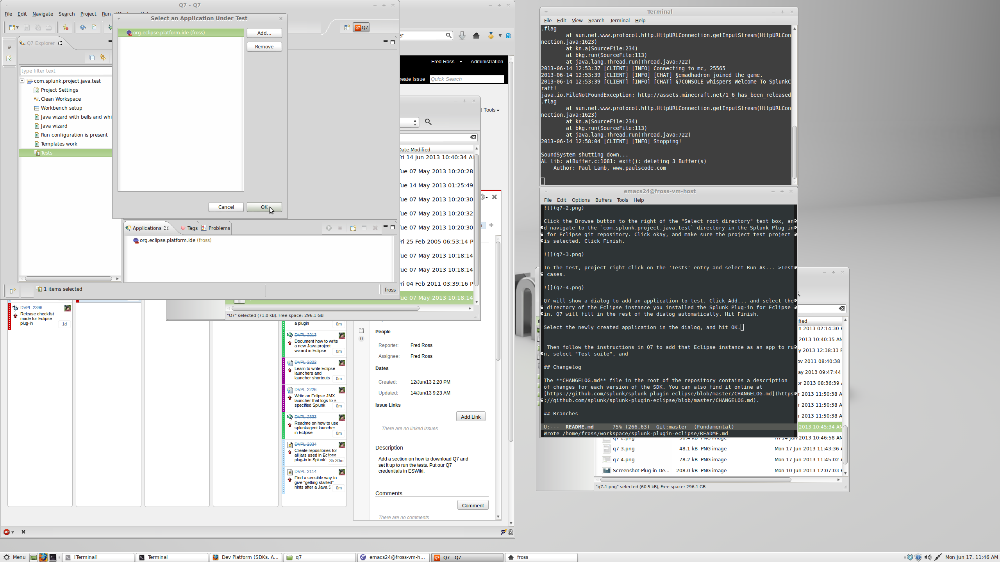

Q7 will load the Eclipse instance in which you installed the plug-in, and run through the tests. Leave your machine alone until it finishes. In Q7's Execution View it will show the results of running the tests.

## Changelog

The **CHANGELOG.md** file in the root of the repository contains a description
of changes for each version of the SDK. You can also find it online at 
[https://github.com/splunk/splunk-plugin-eclipse/blob/master/CHANGELOG.md](https://github.com/splunk/splunk-plugin-eclipse/blob/master/CHANGELOG.md).

## Branches

The **master** branch always represents a stable and released version of the SDK.
You can read more about our branching model on our Wiki at 
[https://github.com/splunk/splunk-sdk-python/wiki/Branching-Model](https://github.com/splunk/splunk-sdk-python/wiki/Branching-Model).

## Documentation and resources
If you need to know more: 

* For all things developer with Splunk, your main resource is the 
  [Splunk Developer Portal](http://dev.splunk.com).

* (TODO: Eclipse specific Splunk docs)

* For more about the Splunk REST API, see the 
  [REST API Reference](http://docs.splunk.com/Documentation/Splunk/latest/RESTAPI).

* For more about about Splunk in general, see 
  [Splunk>Docs](http://docs.splunk.com/Documentation/Splunk).

* For more about this SDK's repository, see our 
  [GitHub Wiki](https://github.com/splunk/splunk-plugin-eclipse/wiki).

* For more information on the logging frameworks supported by the Splunk plug-in
  for Eclipse, see:
    * [SL4J](http://www.slf4j.org/)
    * [Logback](http://logback.qos.ch/)
    * [java.util.logging](http://docs.oracle.com/javase/6/docs/api/java/util/logging/package-summary.html)
    * [Log4J](http://logging.apache.org/log4j/2.x/)

## Community

Stay connected with other developers building on Splunk.

<table>

<tr>
<td><b>Email</b></td>
<td>devinfo@splunk.com</td>
</tr>

<tr>
<td><b>Issues</b>
<td>https://github.com/splunk/splunk-plugin-eclipse/issues</td>
</tr>

<tr>
<td><b>Answers</b>
<td>http://splunk-base.splunk.com/tags/eclipse/</td>
</tr>

<tr>
<td><b>Blog</b>
<td>http://blogs.splunk.com/dev/</td>
</tr>

<tr>
<td><b>Twitter</b>
<td>@splunkdev</td>
</tr>

</table>

### How to contribute

If you would like to contribute to the SDK, go here for more information:

* [Splunk and open source](http://dev.splunk.com/view/opensource/SP-CAAAEDM)

* [Individual contributions](http://dev.splunk.com/goto/individualcontributions)

* [Company contributions](http://dev.splunk.com/view/companycontributions/SP-CAAAEDR)

### Support

* Projects in Preview will not be Splunk supported. Once the Splunk plug-in for Eclipse
   moves to an Open Beta we will provide more detail on support.  

* Issues should be filed here: 
  https://github.com/splunk/splunk-plugin-eclipse/issues

### Contact Us

You can reach the Developer Platform team at _devinfo@splunk.com_.

## License

The Splunk plug-in for Eclipse is licensed under the Apache
License 2.0. Details can be found in the file LICENSE.
